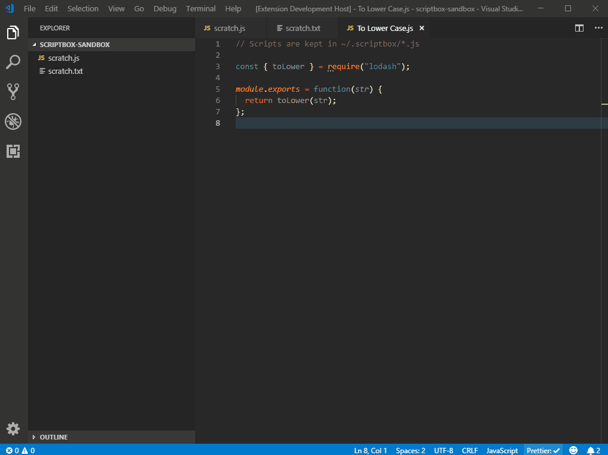

# ScriptBox

Enable on-the-fly scripting of your VS Code environment.



## Usage

1. Create a folder in your home directory named `.scriptbox`
2. Create a JavaScript file in `.scriptbox` named `To Lower Case.js`
3. Add the following

```
module.exports = function(str) {
  return str.toLowerCase();
};
```

4. Select text in another editor
5. Use the **Run Script** command
6. Select the **To Lower Case.js** option
7. _Your text selection has been lower cased_

## Can I Use NPM Packages In My Scripts?

Yes, just use `npm`/`yarn`/etc... to add `packages.json` to your `~/.scriptbox/` directory, add the packages needed, and then `require('the-package')` within your scripts.

## Known Issues

None

## Release Notes

### 0.0.4

Created an `OutputChannel` for all `console.*` statements within a ScriptBox script

### 0.0.3

Started keeping this Release Notes

### 0.0.2

Cleaned up the `README` and `package.json`

### 0.0.1

Initial release of ScriptBox
