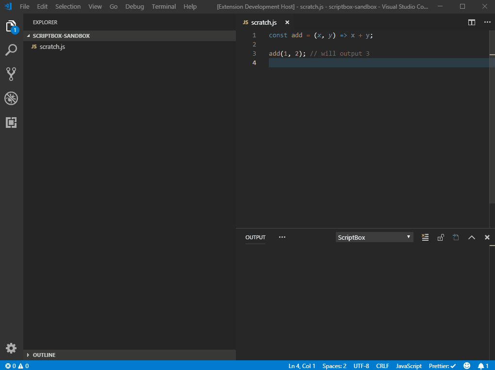

# ScriptBox

Extend VS Code without creating extensions.

ScriptBox enables you to extend VS Code using custom JavaScript code.

To __programmatically modify text__, use [Run Script](#run-script)
- Run your predefined scripts on your current selection
- Run your predefined scripts on the active editor

To __evaluate a JavaScript snippet__, use [Run Selection](#run-selection)
- Run the currently selected text as JavaScript 
- Run the active editor as JavaScript

## Run Script

Execute a predefined script on your current text selection.


### Usage

1. Create a folder in your home directory named `.scriptbox`
2. Create a JavaScript file in `.scriptbox` named `To Lower Case.js`
3. Add the following

```
module.exports = function(str) {
  return str.toLowerCase();
};

```

4. Select text in another editor
5. Use the **Run Script** command
6. Select the **To Lower Case.js** option
7. _Your text selection has been lower cased_

### Script API

Each script is expected to export a single function:

```
function (currentSelection) {
  // manipulate and return the currentSelection string
  // ...
}
```

Each ScriptBox script is passed the current text selection as a `string` (or the entire contents of the active editor if nothing is selected).

The current text selection is **replaced** with the return value if a `string` is returned.

The current text selection is **unchanged** if the return value is `undefined`, `null`, or `false`.

The script function is executed with `this` bound to the [vscode namespace object](https://code.visualstudio.com/docs/extensionAPI/vscode-api).

### Can I Use NPM Packages In My Scripts?

Yes, just use `npm`/`yarn`/etc... to add `packages.json` to your `~/.scriptbox/` directory, add the packages needed, and then `require('the-package')` within your scripts.

## Run Selection

Execute the currently selected JavaScript text (or the entire content of the active editor, if nothing is selected).



## Known Issues

None

## Credits

Logo based on [Hexagon by Chris Kerr from the Noun Project](https://thenounproject.com/term/hexagon/30707/)

## Release Notes

The [CHANGELOG](CHANGELOG.md) contains release notes for each release.
